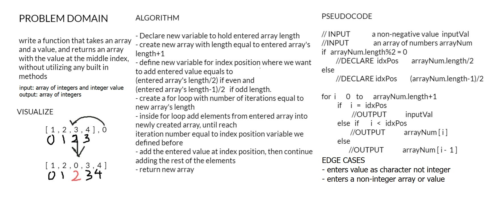

# Insert to Middle of an Array

write a function that takes an array and a value, and returns an array with the value at the middle index, without utilizing any built in methods.

## Whiteboard Process

## Approach & Efficiency

- Declare new variable to hold entered array length
- create new array with length equal to entered array's length+1
- define new variable for index position where we want to add entered value equals to 
(entered array's length/2) if even and  
(entered array's length-1)/2   if odd length.
- create a for loop with number of iterations equal to new array's length
- inside for loop add elements from entered array into newly created array, until reach 
iteration number equal to index position variable we defined before
- add the entered value at index position, then continue adding the rest of the elements
- return new array