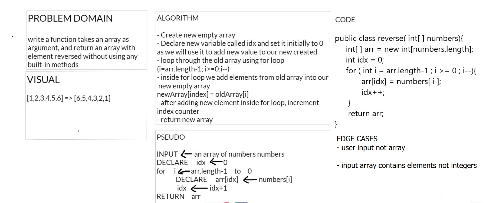

# Reverse an Array

Write a function that takes an array and returns it reversed.

## Whiteboard Process

## Approach & Efficiency

- Create new empty array 
- Declare new variable called idx and set it initially to 0
as we will use it to add new value to our new created
- loop through the old array using for loop 
(i=arr.length-1; i>=0;i--)
- inside for loop we add elements from old array into our new empty array
newArray[index] = oldArray[i]
- after adding new element inside for loop, increment index counter
- return new array
