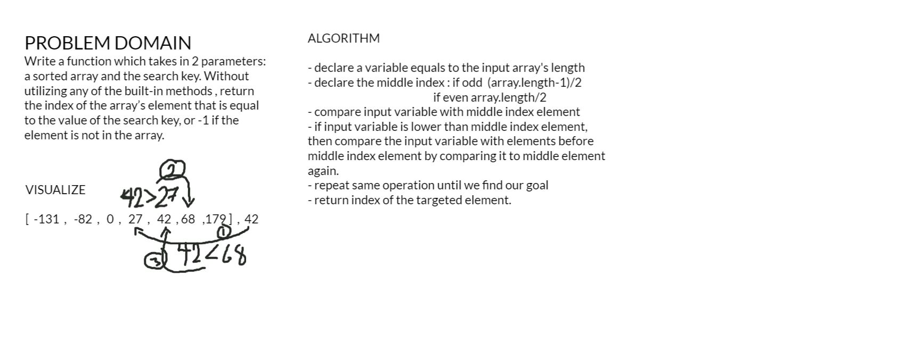

# Binary Search of Sorted Array

Write a function which takes in 2 parameters: a sorted array and the search key. Without utilizing any of the built-in methods , return the index of the array’s element that is equal to the value of the search key, or -1 if the element is not in the array.

## Whiteboard Process

## Approach & Efficiency

ALGORITHM

- declare a variable equals to the input array's length
- declare the middle index : if odd  (array.length-1)/2
                                                     if even array.length/2
- compare input variable with middle index element
- if input variable is lower than middle index element, 
then compare the input variable with elements before
middle index element by comparing it to middle element 
again.
- repeat same operation until we find our goal
- return index of the targeted element.