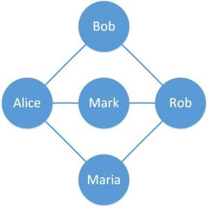
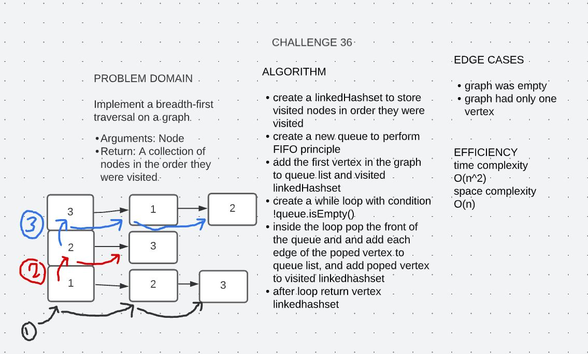
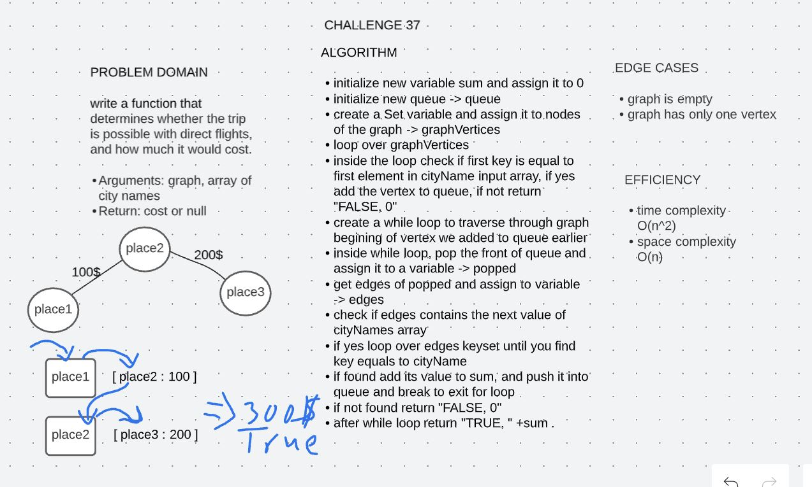
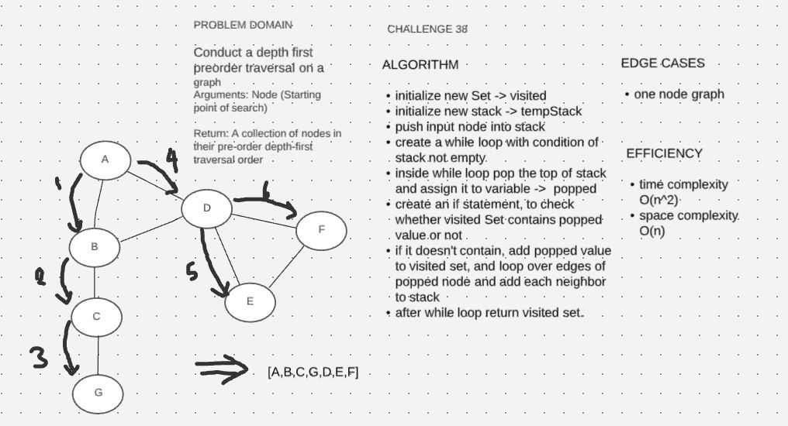

# Graphs

A graph is a data structure for storing connected data like a network of people on a social media platform.

A graph consists of vertices and edges. A vertex represents the entity (for example, people) and an edge represents the relationship between entities (for example, a person's friendships).

Here, we've defined a simple graph with five vertices and six edges. The circles are vertices representing people and the lines connecting two vertices are edges representing friends on an online portal.

## Graphs Implementation

Implement your own Graph. The graph should be represented as an adjacency list.

## Approach & Efficiency

- addNode: Time complexity O(1), space complexity O(n).
- addEdge: Time complexity O(1), space complexity O(1).
- getNodes: Time complexity O(n), space complexity O(1).
- getNeighbors: Time complexity O(1), space complexity O(1).

## API

- addNode
Arguments: value
Returns: The added node
Add a node to the graph
- addEdge
Arguments: 2 nodes to be connected by the edge, weight
Returns: nothing
Adds a new edge between two nodes in the graph , and assign a weight to the edge
Both nodes should already be in the Graph
- getNodes
Arguments: none
Returns all the nodes in the graph as a collection.
- get neighbors
Arguments: node
Returns a collection of edges connected to the given node
Include the weight of the connection in the returned collection
- size
Arguments: none
Returns the total number of nodes in the graph

# Challenge 36 : Breadth First Traverse in Graphs

Implement a breadth-first traversal on a graph.

Arguments: Node

Return: A collection of nodes in the order they were visited.

## Whiteboard Process

## Solution

To run the server application,

clone down this repo.

'cd' into the cloned repository in your terminal

Make sure you have modified the applicaton.properties file with your own environment variables:

To run this code you can either run the App.java file inside src/main/java/insertion/sort folder, which contains four array samples to run the insertion sort method on, or you can simple run the AppTest.java file which contains multiple tests to test our method.

# Challenge 37 : Trip Cost

Write a function that determines whether the trip is possible with direct flights, and how much it would cost.

Arguments: graph, array of city names

Return: String

## Whiteboard Process

## Solution

To run the server application,

clone down this repo.

'cd' into the cloned repository in your terminal

Make sure you have modified the applicaton.properties file with your own environment variables:

To run this code you can either run the App.java file inside src/main/java/insertion/sort folder, which contains four array samples to run the insertion sort method on, or you can simple run the AppTest.java file which contains multiple tests to test our method.

# Challenge 38 : Depth First Traverse in Graphs

Conduct a depth first preorder traversal on a graph

Arguments: Node (Starting point of search)

Return: A collection of nodes in their pre-order depth-first traversal order

## Whiteboard Process

## Solution

To run the server application,

clone down this repo.

'cd' into the cloned repository in your terminal

Make sure you have modified the applicaton.properties file with your own environment variables:

To run this code you can either run the App.java file inside src/main/java/insertion/sort folder, which contains four array samples to run the insertion sort method on, or you can simple run the AppTest.java file which contains multiple tests to test our method.
