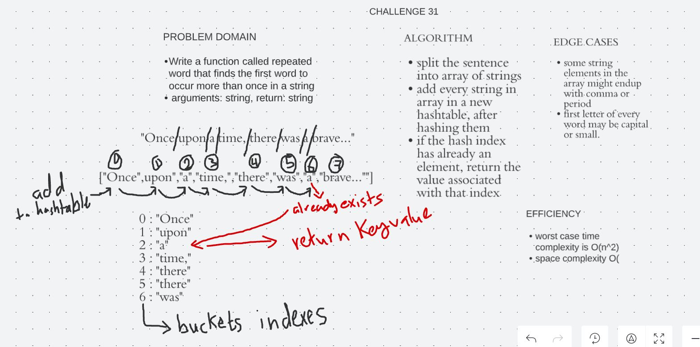

# Hashtables

## Overview

Hashing is a technique that is used to uniquely identify a specific object from a group of similar objects.

In hashing, large keys are converted into small keys by using hash functions. The values are then stored in a data structure called hash table. The idea of hashing is to distribute entries (key/value pairs) uniformly across an array. Each element is assigned a key (converted key). By using that key you can access the element in O(1) time. Using the key, the algorithm (hash function) computes an index that suggests where an entry can be found or inserted.

## Code Challenge: Class 30

Implement hashtable containing add and find value methods.

## Whiteboard Process

## Approach & Efficiency

The efficiency for the following methods are:
- getHash :  time and space complexity of O(1), there is no present for loops or any new data structure.
- getIndex : time and space complexity of O(1), there is no present for loops or any new data structure.
- findValue : since a while loop was used, time complexity will be O(n), and O(1) for space complexity.
- add : time complexity of O(n^2) since there is a nested loops, and space complexity of O(n) in worst cases.
- remove : time complexity of O(n) since a while loop was used, and space complexity of O(1).

## Code Challenge: Class 31

Write a function called repeated word that finds the first word to occur more than once in a string

arguments: string, return: string

## Whiteboard Process

## Approach & Efficiency

Since an array of words that consists of the input string words to loop over them, a loop was used and inside it another loop was used to loop over nodes in a single bucket if it was existed, So time complexity in worst case will be O(n^2).
For space complexity a array data structure was created so will be O(n).

## Solution

To run the server application,

clone down this repo.

'cd' into the cloned repository in your terminal

Make sure you have modified the applicaton.properties file with your own environment variables:

To run this code you can either run the App.java file inside src/main/java/insertion/sort folder, which contains four array samples to run the insertion sort method on, or you can simple run the AppTest.java file which contains multiple tests to test our method.