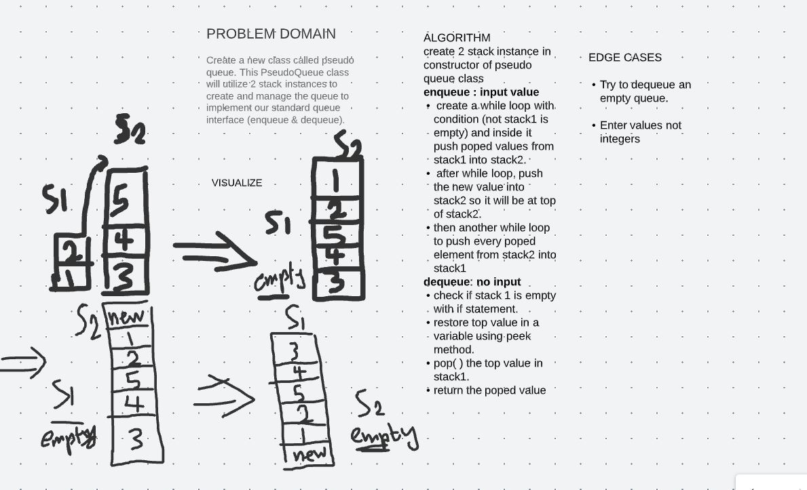

# Class 05

## Challenge

Create a Linked List class
Within your Linked List class, include a head property. Upon instantiation, an empty Linked List should be created. The class should contain the following methods

- insert
Arguments: value
Returns: nothing
Adds a new node with that value to the head of the list with an O(1) Time performance.
- includes
Arguments: value
Returns: Boolean
Indicates whether that value exists as a Node’s value somewhere within the list.
- to string
Arguments: none
Returns: a string representing all the values in the Linked List, formatted as:
"{ a } -> { b } -> { c } -> NULL"

## Approach & Efficiency

## API

- insert
Arguments: value
Returns: nothing
Adds a new node with that value to the head of the list with an O(1) Time performance.
- includes
Arguments: value
Returns: Boolean
Indicates whether that value exists as a Node’s value somewhere within the list.
- to string
Arguments: none
Returns: a string representing all the values in the Linked List, formatted as:
"{ a } -> { b } -> { c } -> NULL"

# Class 06

## Challenge

- append
arguments: new value
adds a new node with the given value to the end of the list

- insert before
arguments: value, new value
adds a new node with the given new value immediately before the first node that has the value specified

- insert after
arguments: value, new value
adds a new node with the given new value immediately after the first node that has the value specified

## Approach & Efficiency

# Class 07
# Challenge Summary
This is extending an impementation problem, we take input k, which is a number repesents the place starting from tail of the linked list, and returns the value of the node at that place.

## Whiteboard Process

## Approach & Efficiency
<!-- What approach did you take? Why? What is the Big O space/time for this approach? -->

## Solution
To run the code you can either open the "App.java" file in "main" folder
and test it there, or you can simply run the "test" folder which contains multiple tests

# Class 08

# Challenge Summary
write a function that takes two linked lists and zip them together into one so that node alternates between the two lists and return a reference to the head of the zipped list.

## Whiteboard Process

## Approach & Efficiency
<!-- What approach did you take? Why? What is the Big O space/time for this approach? -->

## Solution

To run the code you can either open the "App.java" file in "main" folder
and test it there, or you can simply run the "test" folder which contains multiple tests

# Class 10

# Stacks and Queues

A __stack__ and a __queue__ are data structures that consist of Nodes. Each Node references the next Node in the stack, but does not reference its previous.

The main difference between them is stack data structure follows Last In First Out (LIFO) principle, while  queue data structure follow Last In Last Out (LILO) principle.

## Challenge

Create a Queue class that has a front property, and it has following methods: enqueue, dequeue, peek, and isEmpty.
Create a Stack class that has a top property, and it has following methods: push, pop, peek, and isEmpty.

## Approach & Efficiency

In all methods I only used if statements, which will give Big O space and time of 1 ,O(1).

## API

__Queue__ methods:

- enqueue

    - Arguments: value

    - adds a new node with that value to the back of the queue.

- dequeue

   -  Arguments: none

    - Returns: the value from node from the front of the queue

    - Removes the node from the front of the queue

- peek

    - Arguments: none

    - Returns: Value of the node located at the front of the queue

- isEmpty

    - Arguments: none

    - Returns: Boolean indicating whether or not the queue is empty

__Stack__ methods:

- push:

    - Arguments: value

    - adds a new node with that value to the top of the stack .

- pop:

    - Arguments: none

    - Returns: the value from node from the top of the stack

    - Removes the node from the top of the stack

- peek:

    - Arguments: none
    - Returns: Value of the node located at the top of the stack

- isEmpty:

    - Arguments: none
    - Returns: Boolean indicating whether or not the stack is empty.

# Class 11

# Challenge Summary

Create a new class called pseudo queue. This PseudoQueue class will utilize 2 stack instances to create and manage the queue to implement our standard queue interface (enqueue & dequeue).

## Whiteboard Process

## Approach & Efficiency

For enqueue method I used 2 while loops, so time complexity will be O(n^2) and didn't create new data structure so space complexity will be O(1).
For dequeue method I used an if statement, so time complexity will be O(1) and didn't create new data structure so space complexity will be O(1).
