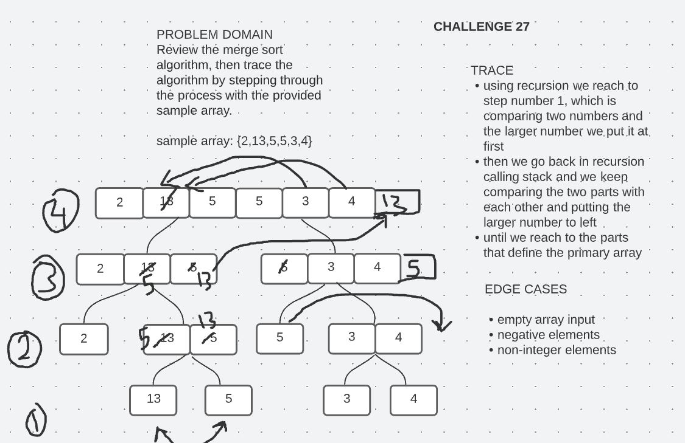

# Challenge Summary

Review the merge sort algorithm, then trace the algorithm by stepping through the process with the provided sample array. 

sample array: `{2,13,5,5,3,4}`

## Whiteboard Process

## Approach & Efficiency

Three separate while loops but recursion was used twice so time complixity would be O(n^2), and space complexity O(n).

## Solution

To run the server application,

clone down this repo.

'cd' into the cloned repository in your terminal

Make sure you have modified the applicaton.properties file with your own environment variables:

To run this code you can either run the `App.java` file inside `src/main/java/insertion/sort` folder, which contains four array samples to run the insertion sort method on, or you can simple run the `AppTest.java` file which contains multiple tests to test our method.