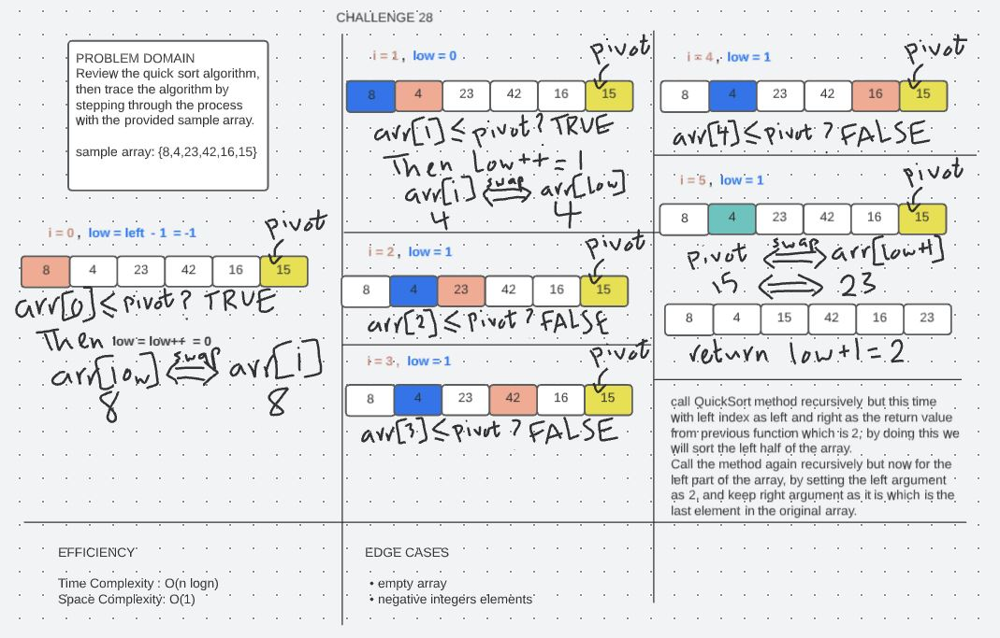

# Quick Sort

## Background

QuickSort is a Divide and Conquer algorithm. It picks an element as pivot and partitions the given array around the picked pivot.There are many different versions of quickSort that pick pivot in different ways.

1- Always pick first element as pivot.

2- Always pick last element as pivot (implemented below).

3- Pick a random element as pivot.

4- Pick median as pivot.

## Challenge Summary

Review the quick sort algorithm, then trace the algorithm by stepping through the process with the provided sample array.

sample array: {8,4,23,42,16,15}

## Whiteboard Process

## Approach & Efficiency

The original array has been halfed and used inside recursion twice so time complexity O(nlogn), while the space complexity is O(1) since no new data structure where created.
## Solution

To run the server application,

clone down this repo.

'cd' into the cloned repository in your terminal

Make sure you have modified the applicaton.properties file with your own environment variables:

To run this code you can either run the App.java file inside src/main/java/insertion/sort folder, which contains four array samples to run the insertion sort method on, or you can simple run the AppTest.java file which contains multiple tests to test our method.