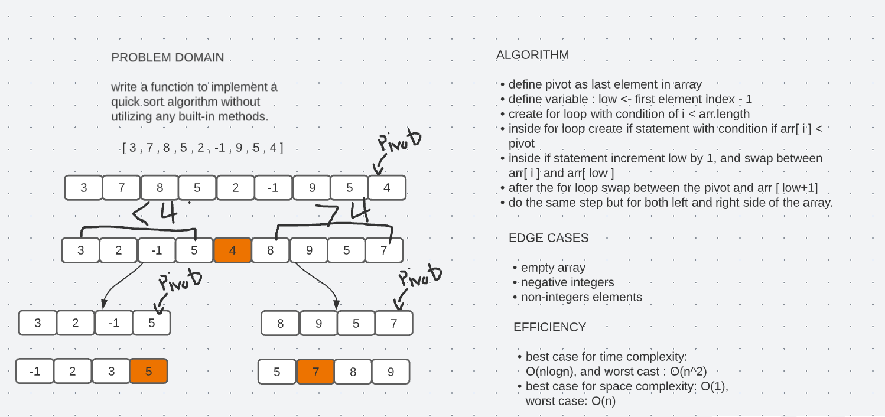

# Quick Sort Interview

# Challenge Summary

write a function to implement a quick sort algorithm without utilizing any built-in methods.

## Whiteboard Process

## Approach & Efficiency

- best case for time complexity: O(nlogn), and worst cast : O(n^2)
- best case for space complexity: O(1), worst case: O(n)

## Solution

To run the server application,

clone down this repo.

'cd' into the cloned repository in your terminal

Make sure you have modified the applicaton.properties file with your own environment variables:

To run this code you can either run the App.java file inside src/main/java/insertion/sort folder, which contains four array samples to run the insertion sort method on, or you can simple run the AppTest.java file which contains multiple tests to test our method.