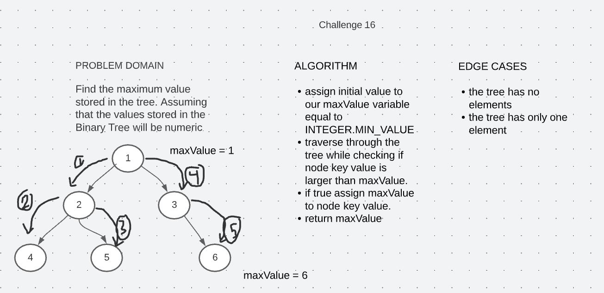

# Trees

A tree is a data structure, whose elements have at most 2 children is called a binary tree. Since each element in a binary tree can have only 2 children, we typically name them the left and right child. A Binary Tree node contains following parts: Data, Pointer to left child, Pointer to right child.

## Challenge 15

In this challenge we created a binary tree, which is a data structure, from scratch. Define a method for each of the depth first traversals: _pre order_, _in order_,_post order_ which returns an array of the values, ordered appropriately. 
Also a binary search tree was created by extending binary tree class, contains methods Add and Contains. Then some tests were created to test functionality.

## Approach & Efficiency

All of the traversing methods (pre order, in order, and post order) have time and space complexity O(1). While add method

## API

Binary Tree:

- preOrder : traversing the tree using pre-order approach ( root >> left >> right ).

- In-order: traversing the tree using pre-order approach ( left >> root >> right ).

- Post-order: traversing the tree using pre-order approach ( left >> right >> root ).

Binary Search Tree:

- add : adds new values to tree.

- containValue :  check whether the tree contains a specific value or not.

# Challenge 16

Find the maximum value stored in the tree. You can assume that the values stored in the Binary Tree will be numeric.

## Whiteboard Process

## Approach & Efficiency

Space complexity O(1) since I didn't use any new data structure, while time complexity is O(n) since I used pre-order traverse.

## Solution

To run and test maxValue method, one can either create new tree and call the method on that tree in `App.java` file, or run pre-written tests in `AppTest.java` file.